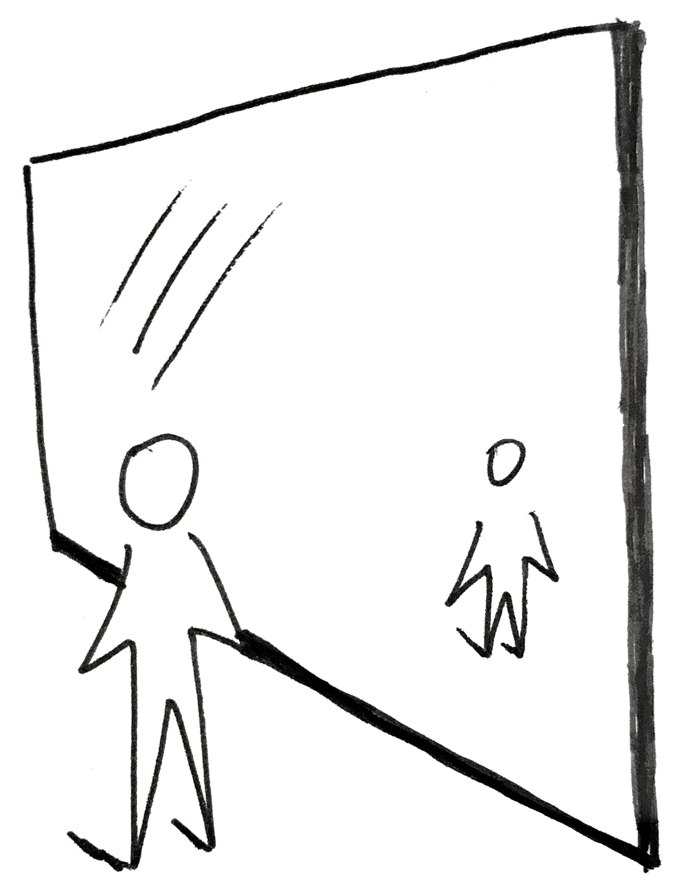

昨天分享了我对[「教练是一面镜子」](http://www.jianshu.com/p/54d0c2abb58c)的理解，把文章发给我亦师亦友的一位资深教练需求反馈（我称呼他周老师），我们通了一个小时电话。
周老师指出昨天的文章比较表面，没有深入谈论教练作为镜子，需要具备哪些核心能力。
于我而言，这一个小时的内容非常之宝贵，是书上学不到的，整理如下。

## 镜子的核心能力
要做好一面镜子，需具备三方面的能力：
* 描述客观事实的能力
* 洞察力
* 有意识地教练的能力

### 描述客观事实的能力
镜子反映的是被教练者的态度、行为和现状。
举例：
**描述人**
主观：
>你有点心不在焉。

客观：
>我观察到，在过去的一分钟，你看了三次手机。

**描述事**
主观：
>你怎么说话不算数，说了五点交报告的，现在五点十分了，报告呢？

客观：
>你答应五点交报告，现在是五点十分，我没有收到你的报告。

### 洞察力
洞察力（Insight）是指透过现象看本质的能力，包括观察和分析。
主要是观察三个部分：
* 手足
* 仪表
* 仪容
顺序是很重要的，脸要最后看，因为我们对颜值的偏执，很容易引入主观评价，从而影响对其他地方的观察。（这段是我补的）
观察过后是分析，如果一个人不停地玩弄手中的物件，可能他是紧张的，如果他的手，随着音乐节奏敲击桌面，可能他就是放松的。

除了在生活中经常观察，并发现现象之间的联系，比如弹吉他的人左手指头有老茧，还可以学习如何解读微动作，微表情。

### 有意识地教练
在教练过程中，不能陷入到客户的问题中，要意识到自己在教练过程中，当前处于哪一个阶段。
在谈话过程中，有意识地关注三条线：
* 信息线（信息传递是否到位）
* 关系线（关系有没有按预期发展）
* 感情线（感情是否按预期变化）

我对关系和感情的区别有点不理解，周老师举了一个例子：
>张三想跟李四做生意，不得已卑躬屈膝。这时候他们的生意关系是建立起来了，但感情是疏远的。

层次低的人，靠感性建立关系，谁对我好我就跟谁亲近。
层次越高的人，越靠理性建立关系，礼数怎么样无所谓，关键是给彼此带来的价值。
所以跟层次低的人谈话，就要照顾 TA 的情感需求，跟层次高的人谈话，就要少说废话，一针见血。

这三条线在任何沟通中都是存在的，三条线的背后，是给对方留下三种印象：
* 理性形象（专业度）
* 感性形象（舒适度）
* 感官形象（看到的，听到的）

信息是否准确到位，语气是否让人舒服，语音语调是否合适，肢体语言是否自然，这些都会影响给对方留下的印象。

---
最后，感谢周老师毫无保留地与我分享！
